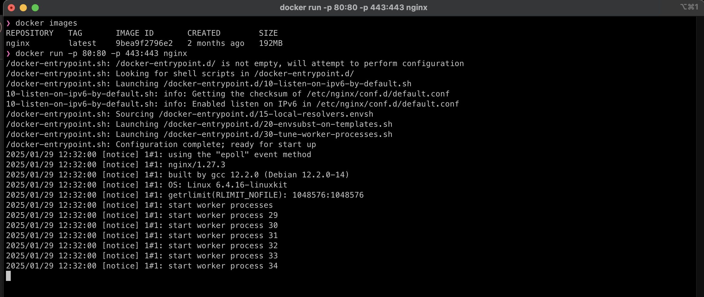
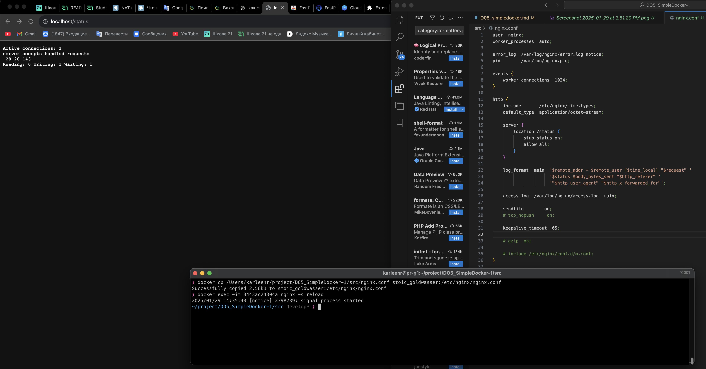
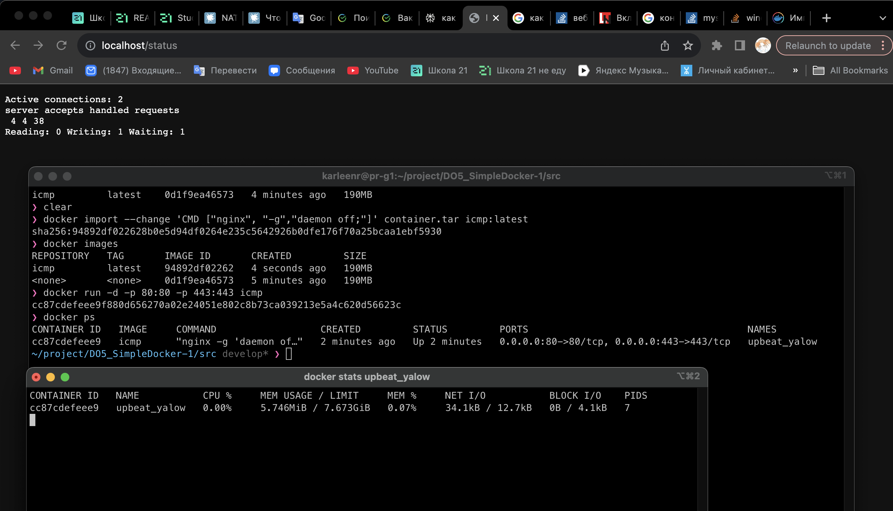
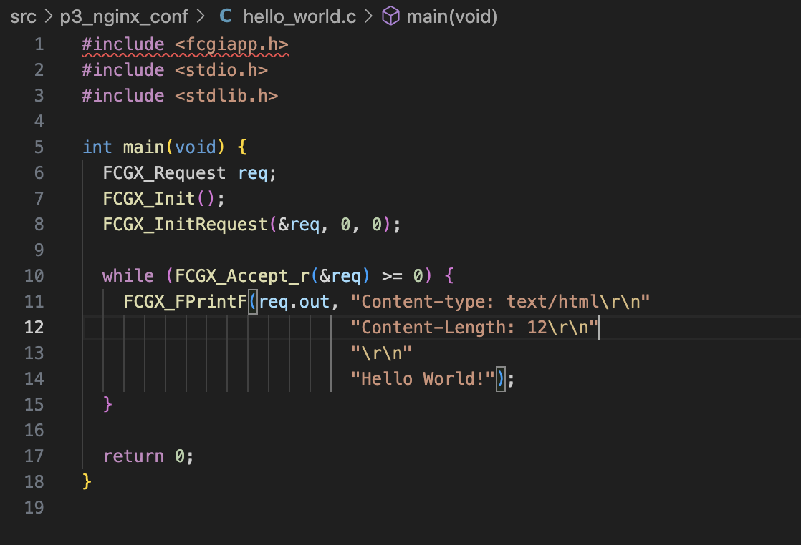

# Part 1. Ready-made docker

Взял официальный докер-образ с nginx и выкачал его при помощи ```docker pull```


Проверил наличие докер-образа через ```docker images```


Запустил докер-образ через ```docker run -d [image_id|repository]```

Проверил, что образ запустился через ```docker ps```


Посмотрел информацию о контейнере через ```docker inspect [container_id|container_name]```

По выводу команды определилил и поместил в отчёт размер контейнера, список замапленных портов и ip контейнера.


Остановил докер контейнер через ```docker stop [container_id|container_name]```

Проверил, что контейнер остановился через docker ps.


Запустил докер с портами 80 и 443 в контейнере, замапленными на такие же порты на локальной машине, через команду ```run```



Проверил, что в браузере по адресу localhost:80 доступна стартовая страница nginx.


Перезапустил докер контейнер через ```docker restart [container_id|container_name]```


# Part 2. Operations with container

Прочитал конфигурационный файл nginx.conf внутри докер контейнера через команду exec.


Создал на локальной машине файл nginx.conf.
Настроил в нем по пути /status отдачу страницы статуса сервера nginx.


Скопировал созданный файл nginx.conf внутрь докер-образа через команду ```docker cp```

Перезапустил nginx внутри докер-образа через команду exec.

Проверил, что по адресу localhost:80/status отдается страничка со статусом сервера nginx.



Экспортировал контейнер в файл container.tar через команду ```export```


Остановил контейнер.


Удалил образ через docker rmi [image_id|repository], не удаляя перед этим контейнеры.

Удалил остановленный контейнер.


Импортировал контейнер обратно через команду ```import```

Так же добавил параметр -c, --change. 

  -Применить инструкцию Dockerfile к созданному образу

Так выглядит команда целиком ```docker import --change 'CMD ["nginx", "-g","daemon off;"]' container.tar icmp:latest```  
Здесь я указал команду по умолчанию (CMD), которая будет выполняться при запуске контейнера. В данном случае:
nginx: это команда для запуска веб-сервера Nginx.
-g 'daemon off;': этот флаг указывает Nginx работать в переднем плане (foreground), а не запускаться как демон. Это важно для работы контейнеров Docker, так как процесс должен оставаться активным в переднем плане, чтобы контейнер не завершился.



Проверил, что по адресу localhost:80/status отдается страничка со статусом сервера nginx.

# Part 3. Mini web server

Запустил контейнер nginx с именем  fcgi_serv и портами 80:80 443:433 81:81


Написал мини-сервер на C и FastCgi, который будет возвращать простейшую страничку с надписью Hello World!.



Написал свой nginx.conf, который будет проксировать все запросы с 81 порта на 127.0.0.1:8080.


Теперь копируем nginx.conf и hello_world.c в контейнер /etc/nginx/

```docker cp /Users/karleenr/project/DO5_SimpleDocker-1/src/p3_nginx_conf/nginx.conf fcgi_serv:/etc/nginx/nginx.confz```

```docker cp /Users/karleenr/project/DO5_SimpleDocker-1/src/p3_nginx_conf/hello_world.c fcgi_serv:/etc/nginx/```


Заходим в контейнер 

```docker exec -it $(docker ps -q) sh```

 

$(docker ps -q) выводит только ID контейнера 

Обновляем и загружаем все необходимые инструменты для работы с FCGI и С.

```apt-get update && apt-get install -y gcc g++ make libfcgi-dev spawn-fcgi pkg-config```


Компилируем наш .c файл

```gcc hello_world.c -o hello_world.fcg `pkg-config --cflags --libs fcgi```


После запускаем наш исходник с помощью spawn-fcgi на порту 8080.

```spawn-fcgi -n -p 8080 hello_world.fcg```


Выходим из контейнера командой ```exit``` и обновляем его


Проверил, что в браузере по localhost:81 отдается написанная тобой страничка.


# Part 4. Your own docker

Написал свой докер-образ, который:

1) собирает исходники мини сервера на FastCgi из Части 3;

2) запускает его на 8080 порту;

3) копирует внутрь образа написанный ./nginx/nginx.conf;

4) запускает nginx.


Соберал написанный докер-образ через docker build при этом указав имя и тег.

Проверил через docker images, что все собралось корректно.

Запустил собранный докер-образ с маппингом 81 порта на 80 на локальной машине и маппингом папки ./nginx внутрь контейнера по адресу, где лежат конфигурационные файлы nginx'а

Проверил, что по localhost:80 доступна страничка написанного мини сервера.


Дописал в ./nginx/nginx.conf проксирование странички /status, по которой надо отдавать статус сервера nginx.


Перезапустил докер-образ и проверил, что теперь по localhost:80/status отдается страничка со статусом nginx


# Part 5. Dockle

Установил Dokcle командой ```brew install goodwithtech/r/dockle```

После установки Docker нужно проверить докер-обрал командой ```dockle [image_id|repository]```. Но перед этим нужно запушить образ в Докер Хаб, тк локально Dockel образа не видит. 

```docker push karleenr/p4_image:1.0```


Командой ```dockle karleenr/p4_image:1.0``` проверил образ на наличие уязвимостей


## Ошибки: 

```FATAL	- CIS-DI-0010:``` относится к рекомендациям CIS (Center for Internet Security) по безопасности контейнеров. Эта ошибка указывает на то, что в Dockerfile или образе контейнера обнаружены потенциальные проблемы с безопасностью, связанные с хранением учетных данных или конфиденциальной информации в переменных окружения или файлах.


```FATAL - DKL-DI-0005:``` Clear apt-get caches указывает на то, что в Dockerfile необходимо очищать кэш APT после установки пакетов. Это является рекомендацией по безопасности и оптимизации размера образа.


```WARN - CIS-DI-0001:``` Create a user for the container указывает на то, что в Dockerfile контейнер по умолчанию запускается от имени пользователя root, что считается небезопасным. Рекомендуется создавать отдельного пользователя для выполнения приложений внутри контейнера, чтобы минимизировать риски безопасности. 


## Исправление ошибок:

```FATAL - DKL-DI-0005:``` добавил в Dockerfile очистку кэша после установки пакетов

```WARN - CIS-DI-0001:``` создал нового пользователя без пароля

```FATAL	- CIS-DI-0010:``` при запуске dockle указываю, что разрешаю использование конкретных ключей для работы nginx. ```--ak NGINX_GPGKEY --ak NGINX_GPGKEY_PATH --ak NGINX_GPGKEYS```

Так выглядит исправленный Dockerfile


Проверка на ошибки и предупреждения


Остались только информационные сообщения от Dockle

```INFO	- CIS-DI-0005:``` Enable Content trust for Docker
	* export DOCKER_CONTENT_TRUST=1 before docker pull/build

```INFO	- CIS-DI-0006:``` Add HEALTHCHECK instruction to the container image
	* not found HEALTHCHECK statement

```INFO	- CIS-DI-0008:``` Confirm safety of setuid/setgid files

# Part 6. Basic Docker Compose

Напишу файл docker-compose.yml, с помощью которого:

1) Подниму докер-контейнер из Part 5.

2) Подниму докер-контейнер с nginx, который будет проксировать все запросы с 8080 порта на 81 порт первого контейнера.

Так же замаплю 8080 порт второго контейнера на 80 порт локальной машины.

Так выглядит docker-compose.yml


Так же напишу nginx.conf который слушает порт 8080 и проксирует первый контейнер (local_cont) на порт 81


Остановил все запущенные контейнеры.

Соберал и запустил проект с помощью команд ```docker-compose build``` и ```docker-compose up``` или их комбинация (docker-compose up --build). Запускать нужно из директории, в которой находится docker-compose.


Так же в терминале вывлдятся логи с контейнеров

